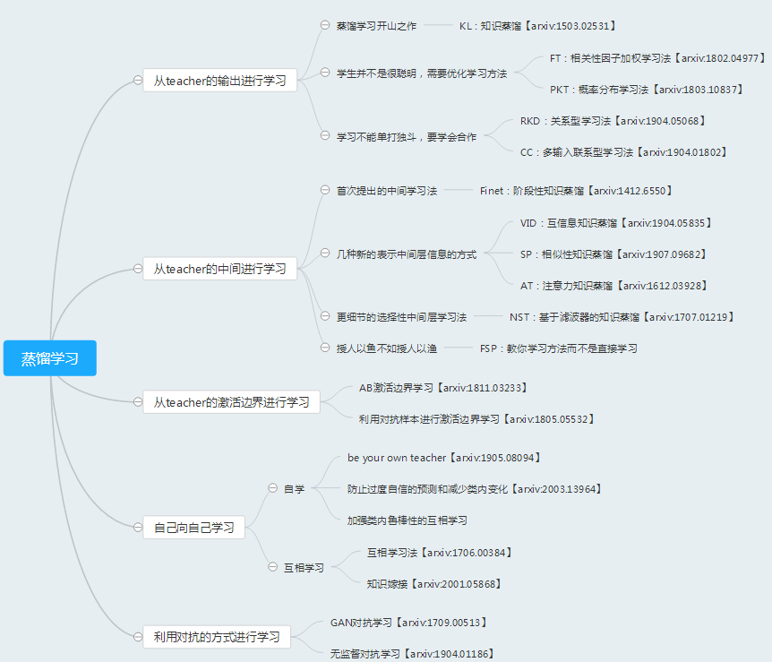
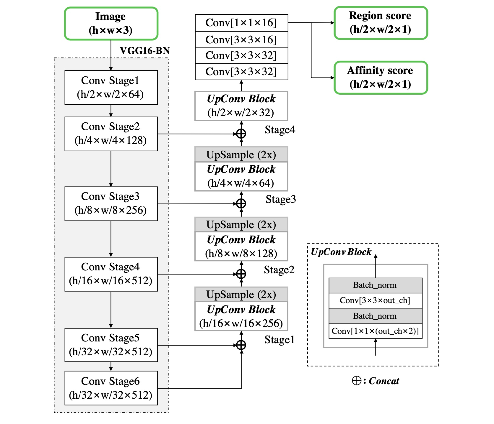
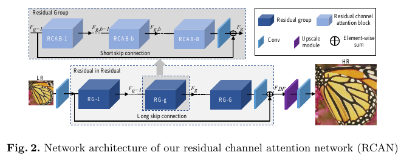
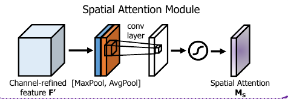

# 基于注意力蒸馏的超分网络

​	通过将文本检测的知识蒸馏到超分网络，提升超分网络对场景文字图片的超分效果，从而提升文本检测的效果。

**设计思想：**

将文字检测的中间层特征得到的空间注意力特征图，通过知识蒸馏的方法，指导超分网络的训练。

## 方案的提出

### 知识蒸馏方法

**蒸馏定义**	

将复杂、学习能力强的网络学到的特征表示“知识蒸馏”出来（将大模型学习出来的知识作为先验），传递给参数量小、学习能力弱的网络。从而得到一个速度快，能力强的网络。

**蒸馏方法论文总结**

https://blog.csdn.net/qiu931110/article/details/105904211

**蒸馏方法的选择**

将teacher网络的中间特征提取，经过处理得到新的特征表示（即注意力特征图），然后学生网络的注意力模块学习该特征图。 

### 注意力机制

**注意力方法定义**

注意力机制就是定位感兴趣信息，抑制无用信息，结果通常以概率图或者概率特征向量的形式展示。

**常用的注意力方法**

空间注意力，通道注意力， 残差注意力机制，多尺度注意力机制，递归注意力机制

**注意力方法的选择**

针对文字检测任务的超分，为提升文字区域的超分效果， 选择空间注意力方法。

- 教师网络使用空间注意力激活映射函数得到空间注意力map

Paying more attention to  attention

- 学生网络添加空间注意力网络模块

CBAM：Convolutional Block Attention Module2018

## 网络结构设计

## 教师网络与学生网络的选取

###  教师网络（CRAFT：字符位置可感知的文本检测）

选取原因：带预训练模型，可顺利运行，效果较好(与EAST比较)，pytorch。

#### 字符位置可感知的文本检测的CRAFT

​	该卷积神经网络**生成字符区域得分**和**相互关系得分**。区域得分表示给定像素是字符中心的概率，而相互关系力得分表示相邻字符之间空间的中心概率

区域分数用于在图像中定位单个字符，而相互关系分数用于将每个字符分组为一个实例。

​														Figure 1 craft 网络结构

特点：

提出的标签定义使模型能够充分检测大型或长文本实例，尽管使用的感受野较小。

使卷积滤波器可以仅关注字符内和字符间，而不关注整个文本实例。

### 学生网络（RCAN：深度残差注意力超分网络）

选取原因：目前SR网络中效果最好，且有完整代码。

​														Figure 2 RCAN网络结构

## 特征的选取与处理

### 教师网络选取的特征层

**特征层选取**

上采样层的中间层，最后一层， 以及头部网络的中间两层。特征图尺寸分别为（1/8, 1/2,  1/2, 1/2）倍的W,H。

**原因**

由vgg16作为骨干网络的部分得到检测到的特征， 后续的网络对特征进行处理，获取目标的位置和类别信息。所以认为上层的网络包含更丰富的目标位置信息。

### 学生网络选取的添加空间注意力模块的层

**特征层选取**

第一层卷积， 中间两个RG层(总共10层，取了第3层和第7层)， 上采样模块层的最后一层。

**原因**

结构上比较均匀。

### 教师网络的特征空间注意力激活方法

​	该方法基于一个潜在假设，认为**隐藏层神经元激活的绝对值可以用于指示这个神经元的重要性。**

对于教师网络中间层输出的特征，使用以下公式计算。
$$
F(A) =\sum_{i=1}^C|A_i|^p
$$
其中，A为输入的特征图，C为输出张量中的通道数， F(A)为空间注意力激活特征图。

输出得到shape为（b, 1, w/r, h/r）的教师空间注意力激活特征图。

### 学生网络的注意力特征图的获取

学生注意力特征图使用一个空间注意力模块获取。

​														Figure 3 学生网络空间注意力模块

​	

输入学生网络的中间层特征， 首先经过通道维度的最大池化和平均池化，然后将连接后的值经过一个padding为2的3×3卷积，输出通道为1。

经过该模块后返回shape为(b, 1, w/r', h/r')的学生注意力特征图。

## 损失函数

### SR损失

MSE

### 蒸馏损失计算

**1.激活空间注意力特征的知识蒸馏**

让学生注意力模块得到的空间注意力特征和教师网络的空间注意力激活特征尽可能相似。

$$
F(A) =\sum_{i=1}^n|A_i|
$$

空间激活注意力损失计算：
$$
L_{AD}(Q_T,Q_S) = \sum_{j\in{I}}||\frac{F_s(A)}{||F_s(A)||_2} - \frac{F_t(A)}{||F_t(A)||_2}||_2
$$

此处， 

**2.相似性矩阵知识蒸馏 (batch_size大小的矩阵相乘)**

该方法不需考虑输入的特征图的尺寸。

**3.损失函数数量级问题，损失权重的设置**

1*MSE  , 1\*SD+1\*AD

sr loss:4198.17724609375
f_loss0: 0.03202895075082779  f_loss1: 2.9520325660705566
loss sum: tensor(4201.1611, device='cuda:0', grad_fn=<AddBackward>)

## 实验：

### 1.注意力蒸馏对原始超分网络RCAN的影响

#### 实验设计

两种模型RCAN, RCAN_dat分别在高法数据集上进行训练。 

#### 实验结果

比较两者的超分指标

### 2.超分图片对文字检测效果的影响

#### 实验设计

**1）直接进行文字检测**

**2）经过作者给出的原始RCAN模型进行超分，然后进行文字检测**

**3）经过重新训练后的RCAN进行超分，然后进行文字检测**

**4）经过重新训练后的RCAN_dat进行超分，然后进行文字检测**

#### 实验过程

1.用于文字检测的数据集

测试集 ICDAR(2013,2015,2017)数据集 或者MSRA-TD500，CTW-1500和TotalText数据集。

2.文字检测评价指标

#### 实验结果

